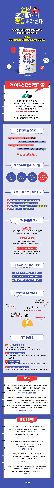

# 실무에 바로 적용하는 웹 접근성 가이드북

<div align="center">
  
</div>

**실무에 바로 적용하는 웹 접근성 가이드북**에 수록된 예제 코드로 만든 컴포넌트를 스토리북에서 직접 확인할 수 있는 저장소입니다.

---

### 스토리북

##### 배포된 스토리북 확인

https://evie-ooooori.github.io/accessibility-guide-book-for-component

<br />

##### 로컬 스토리북 실행 가이드

```bash
git clone https://github.com/evie-ooooori/accessibility-guide-book-for-component.git
yarn install
yarn storybook
```

http://localhost:6006 에서 확인

---

<div align="center">
  
</div>
