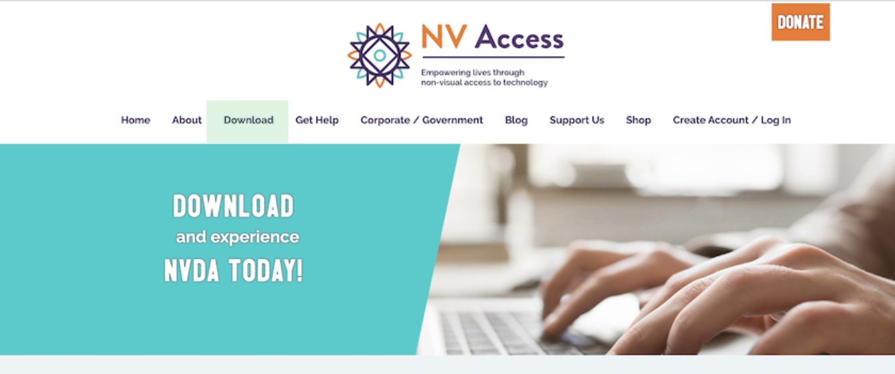
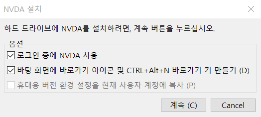
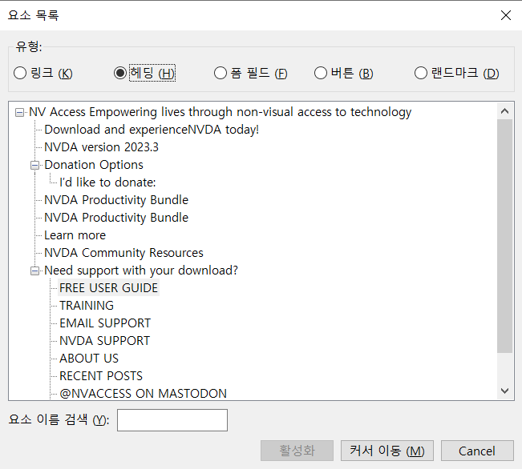
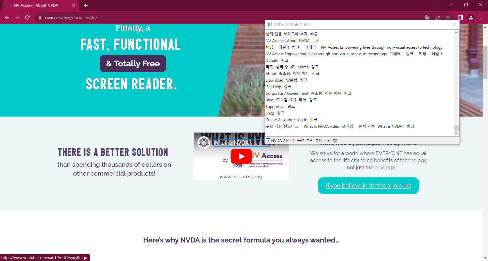
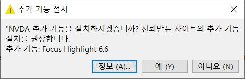
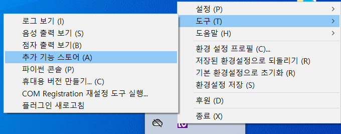
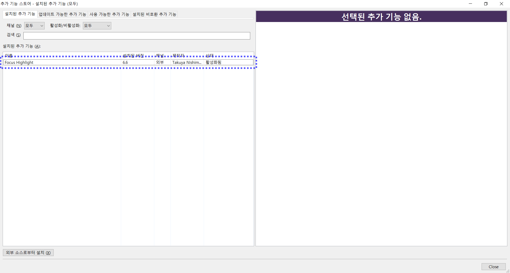

import { Meta } from "@storybook/blocks";

<Meta title="스크린 리더 사용법/데스크톱/NVDA" />

# NVDA(NonVisual Desktop Access)

오픈 소스 스크린 리더인 NVDA는 무료로 다운로드하여 사용할 수 있습니다. 오픈 소스로 많은 개발자 및 사용자 커뮤니티에 의해 지속적으로 업데이트되고 있습니다. 또한 NVDA는 Chrome, Microsoft Edge 브라우저와의 호환성이 뛰어납니다.

**[특징]**

- 웹 브라우저, 오피스 관련 프로그램 등을 포함한 다양한 응용 프로그램 사용 가능
- 80개국 이상의 언어를 내장한 음성엔진 탑재
- 마우스가 위치한 곳의 글자를 자동으로 읽어 쉽게 탐색 가능
- 다양한 점자 디스플레이 지원 및 자동 인식 가능(디스플레이가 점자 키보드를 탑재한 경우 텍스트 입력도 가능)
- 컴퓨터에 설치하지 않아도 USB 드라이브나 다른 휴대용 미디어에서 NVDA를 완벽하게 실행 가능
- 54개국 언어로 번역됨
- Windows 7, Windows 8, Windows 8.1, Windows 10, Windows 11의 모든 32비트 및 64비트 버전과 Windows Server 2008 R2부터 시작하는 모든 서버 운영 체제에서 동작
- 터치 명령을 사용하여 컨트롤 및 텍스트 읽기 가능
- 시스템 포커스 하이라이트 기능

<br />

---

<br />

### NVDA 설치 방법

NVDA는 NVAccess(https://www.nvaccess.org/)에서 다운로드 해야 합니다. `Download`로 이동하여 해당 페이지(https://www.nvaccess.org/download/)에서 `DOWNLOAD` 버튼을 클릭하여 파일을 다운로드 후 NVDA를 설치합니다. 브라우저에 따라 파일 다운로드 후 자동으로 실행될 수 있습니다.



<br />



### NVDA 실행하기

설치 시 바탕화면에 바로가기 아이콘을 만들었다면 단축키 `ctrl + alt + n`으로 NVDA 실행이 가능합니다.


```plaintext
💡 NVDA 2023.3 사용자 가이드 기준으로 설명합니다. 더 자세한 설명은 가이드 문서(https://www.nvaccess.org/files/nvda/documentation/userGuide.html)의 내용을 통해 확인할 수 있습니다.
```

### 실행 및 제어

<table>
  <thead>
    <tr>
      <th>기능</th>
      <th>단축키</th>
    </tr>
  </thead>
  <tbody>
    <tr>
      <td>NVDA 시작</td>
      <td>`Ctrl + alt + n`</td>
    </tr>
    <tr>
      <td>NVDA 종료</td>
      <td>`NVDA + q`</td>
    </tr>
    <tr>
      <td>음성출력 정지</td>
      <td>`Ctrl`</td>
    </tr>
    <tr>
      <td>음성출력 일시정지</td>
      <td>`Shift`</td>
    </tr>
  </tbody>
</table>

```plaintext
💡 NVDA 키의 기본값은 Insert 키이며, Caps Lock 키로 바꿀 수 있습니다. 기본적으로 데스크톱 키보드 레이아웃이 설정되어 있어 노트북을 사용할 경우 NVDA > 설정 > 키보드 설정에서 랩탑 레이아웃으로 전환할 수 있습니다.
```

### 텍스트 읽기

<table>
  <thead>
    <tr>
      <th>기능</th>
      <th>데스크톱 단축키</th>
      <th>노트북 단축키</th>
      <th>설명</th>
    </tr>
  </thead>
  <tbody>
    <tr>
      <td>이전 글자 한 글자 읽기</td>
      <td>`leftArrow(←)`</td>
      <td>`leftArrow(←)`</td>
      <td>왼쪽으로 이동해 한 글자를 읽습니다.</td>
    </tr>
    <tr>
      <td>다음 글자 한 글자 읽기</td>
      <td>`rightArrow(→)`</td>
      <td>`rightArrow(→)`</td>
      <td>다음 글자를 한 글자를 읽습니다.</td>
    </tr>
    <tr>
      <td>이전 한 단어 읽기</td>
      <td>`numpad4`</td>
      <td>`NVDA + Ctrl + leftArrow(←)`</td>
      <td>왼쪽으로 이동해 한 단어를 읽습니다.</td>
    </tr>
    <tr>
      <td>다음 한 단어 읽기</td>
      <td>`numpad6`</td>
      <td>`NVDA + Ctrl + rightArrow(→)`</td>
      <td>오른쪽으로 이동해 한 단어를 읽습니다.</td>
    </tr>
    <tr>
      <td>현재 줄 읽기</td>
      <td>`NVDA + upArrow(↑)`</td>
      <td>`NVDA + l`</td>
      <td>현재 줄을 읽습니다.</td>
    </tr>
    <tr>
      <td>모두 읽기</td>
      <td>`NVDA + downArrow(↓)`</td>
      <td>`NVDA + a`</td>
      <td>현재 위치에서 시작하여 전체 내용을 읽습니다.</td>
    </tr>
  </tbody>
</table>

### 정보 제공

<table>
  <thead>
    <tr>
      <th>기능</th>
      <th>단축키</th>
      <th>설명</th>
    </tr>
  </thead>
  <tbody>
    <tr>
      <td>창 제목</td>
      <td>`NVDA + t`</td>
      <td>현재 활성 창의 제목을 읽습니다.</td>
    </tr>
    <tr>
      <td>창 읽기</td>
      <td>`NVDA + b`</td>
      <td>현재 창 전체를 읽습니다.</td>
    </tr>
    <tr>
      <td>링크 탐색</td>
      <td>`NVDA + k`</td>
      <td>한 번 누르면 현재 포커스 위치에 있는 링크의 대상 URL을 말합니다.</td>
    </tr>
  </tbody>
</table>

### 웹 내비게이션

<table>
  <thead>
    <tr>
      <th>기능</th>
      <th>단축키</th>
      <th>설명</th>
    </tr>
  </thead>
  <tbody>
    <tr>
      <td>대화형 콘텐츠 요소 컨트롤</td>
      <td>`Tab`</td>
      <td>링크 및 양식 컨트롤과 같은 대화형 콘텐츠 요소를 찾아 이동합니다.</td>
    </tr>
    <tr>
      <td>요소 역순 탐색</td>
      <td>`Shift + 단축키`</td>
      <td>요소를 역순으로 찾아 이동합니다.</td>
    </tr>
    <tr>
      <td>헤딩 요소</td>
      <td>`h`</td>
      <td>다음 헤딩 요소를 찾아 이동합니다.</td>
    </tr>
    <tr>
      <td>헤딩 레벨 1 또는 2 또는 3 인 요소</td>
      <td>`1, 2, 3`</td>
      <td>다음 특정 레벨의 헤딩 요소로 찾아 이동합니다.</td>
    </tr>
    <tr>
      <td>링크 요소</td>
      <td>`k`</td>
      <td>다음 링크 요소를 찾아 이동합니다.</td>
    </tr>
    <tr>
      <td>목록 요소</td>
      <td>`l`</td>
      <td>다음 목록 요소를 찾아 이동합니다.</td>
    </tr>
    <tr>
      <td>표 요소</td>
      <td>`t`</td>
      <td>다음 표 요소를 찾아 이동합니다.</td>
    </tr>
    <tr>
      <td>대화형 요소</td>
      <td>`f`</td>
      <td>다음 대화형 요소를 찾아 이동합니다.</td>
    </tr>
    <tr>
      <td>랜드마크</td>
      <td>`d`</td>
      <td>다음 랜드마크로 이동합니다.</td>
    </tr>
  </tbody>
</table>

```plaintext
💡 요소 목록 탐색

요소 목록은 NVDA + f7를 이용해 확인할 수 있습니다. 요소 목록은 현재 페이지의 구조를 나열한 목록으로 링크, 제목, 양식 필드, 버튼 또는 랜드마크와 같은 다양한 유형의 요소를 목록으로 확인할 수 있습니다. 원하는 요소로 이동하거나 실행할 수도 있어 사용자가 페이지의 구조를 이해하고, 특정 요소를 찾고 실행하는 데 도움을 줍니다.
```



### 알아두면 편리한 기능

#### 음성 출력 뷰어

NVDA 음성 출력 뷰어는 개발 과정에서 빠른 테스트를 위해 스크린 리더의 음성 피드백이 필요하지 않은 경우 특히 유용하게 사용할 수 있습니다. 음성 출력 뷰어는 `NVDA > 도구 > 음성 출력 뷰어 설정`을 통해 실행할 수 있습니다.


음성 출력되는 내용을 시각적으로 정확하고 빠르게 확인 가능합니다. 또한, 음성 출력 뷰어 내의 텍스트의 복사도 가능합니다.



#### 초점 하이라이트

NVDA는 사용자가 필요에 따라 추가 기능을 활용할 수 있도록 확장성을 보장합니다. 특히 초점 하이라이트 기능은 현재 초점이 맞춰진 UI 요소를 시각적으로 강조하여 개발자가 더 쉽게 인지할 수 있을 뿐만 아니라 키보드 또는 다른 입력 장치를 통해서도 해당 요소와 상호작용을 편리하게 할 수 있습니다.

초점 하이라이트는 기능은 addons nvda project 웹사이트(https://addons.nvda-project.org/index.ko.html)에서 다운로드해 추가할 수 있습니다. 해당 웹사이트에서 Focus Highlight를 검색해 `Download stable version` 링크를 클릭해 애드온 파일을 다운로드합니다. 다운로드한 애드온 파일을 실행하면 추가 기능 설치 여부에 대한 응답을 요청하는 대화 상자가 노출되며, 예를 눌러 설치를 진행합니다.



설치가 완료된 초점 하이라이트는 바로 활성화되어 초점이 표시됩니다. 만약 비활성화가 필요하다면 `NVDA > 도구 > 추가 기능 스토어` 로 이동해 노출되는 추가 기능 스토어 대화 상자에서 설정할 수 있습니다.



<br />



초점 하이라이트는 아래와 같은 스타일을 사용합니다.

- 녹색의 얇은 점선 직사각형 박스: NVDA가 탐색 모드에 있으며, 현재 내비게이션 된 요소인 경우 나타납니다.
- 빨간색의 얇은 직사각형 박스: NVDA가 탐색 모드에 있으며, 컨트롤이 가능한 요소에 초점 이동한 경우 나타납니다.
- 빨간색의 굵은 직사각형 박스: NVDA가 탐색 모드에 있으며, 현재 내비게이션 된 요소이면서 컨트롤이 가능한 요소에 초점 이동한 경우 나타납니다.
- 파란색의 굵은 점선 직사각형 박스: NVDA가 초점 모드에 있음을 나타냅니다.

`Tab` 과 `Shift + Tab` 을 사용해 현재 페이지의 초점 가능한 요소를 탐색할 경우 빨간색 강조 박스가 노출됩니다. 또한, 화살표 키를 활용해 텍스트의 내용을 읽는 경우 녹색 점선 박스가 노출됩니다.


