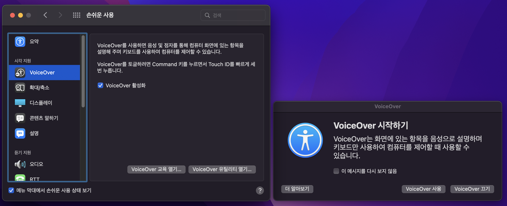
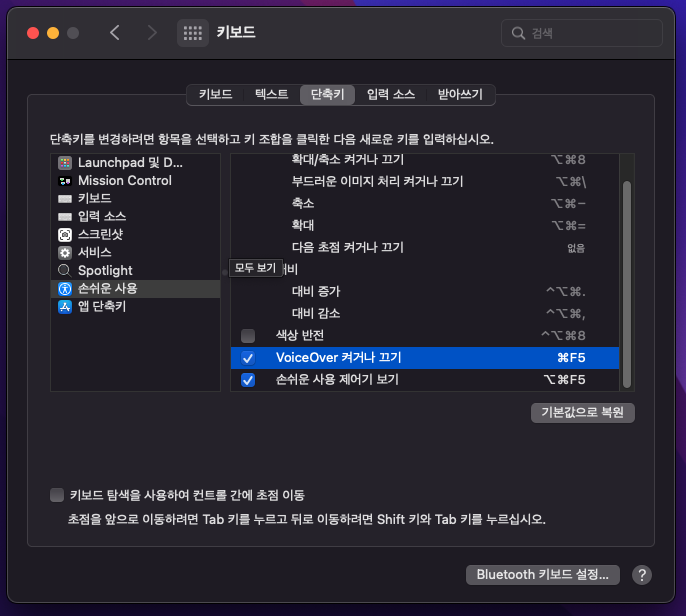

import { Meta } from "@storybook/blocks";

<Meta title="스크린 리더 사용법/데스크톱/VoiceOver" />

# VoiceOver for Mac

VoiceOver는 애플의 MacOS에 내장된 스크린 리더로 활성화하면 컴퓨터의 모든 정보가 음성으로 사용자에게 전달됩니다. 사용자는 키보드, 트랙패드 등의 다양한 입력 장치를 통해 VoiceOver를 조작할 수 있습니다.
또한, 사용자는 자신이 선호하는 환경에 맞게 설정을 수정할 수 있습니다. 음성 출력 속도나 톤을 사용자가 듣기 편하게 조절할 수 있으며, 시각과 청각 모두 정보를 습득하기 어려운 사용자를 위해 점자 디스플레이를 지원합니다. 이러한 다양한 기능들은 VoiceOver 유틸리티를 통해 쉽게 설정할 수 있습니다.

```plaintext
💡 VoiceOver 유틸리티

VoiceOver 유틸리티를 사용하면 VoiceOver 설정을 사용자화할 수 있습니다. 이를 통해 음성을 변경하거나 점자 기기를 연결하고, VoiceOver를 사용하는 방법에 대한 다양한 옵션을 설정할 수 있습니다.
특히, VoiceOver 유틸리티의 동작 카테고리를 활용하면 특정 사용, 앱 또는 웹 사이트를 위한 동작이나 설정 그룹을 만들 수 있습니다. 이를 통해 각 활동에 맞게 VoiceOver의 동작을 쉽게 조정할 수 있습니다. 예를 들어 온라인 쇼핑과 기사 읽기를 위한 두 가지 동작 그룹을 만들어 각각에 대해 다른 음성과 읽기 속도를 설정할 수 있습니다.
```

**[특징]**

- 다양한 브라우저 및 응용 프로그램과의 상호 작용 가능
- 사용자 정의 음성(음성 속도, 톤, 발음 방식 등) 설정 가능
- 키보드 명령 사용자 정의 가능
- 텍스트 기반의 문서 내용 읽기 및 편집 가능
- 다국어 지원
- 대화형 튜토리얼 및 도움말 제공으로 기능 활용 도움
- 화면 확대 및 축소 기능 제공
- 점자 출력 및 점자 디스플레이 지원
- 키보드 단축키 사용자 정의 가능
- 트랙패드 제스처를 사용한 요소 탐색 및 상호 작용 가능

<br />

---

<br />

### VoiceOver 실행하기

VoiceOver를 실행하는 데는 아래와 같은 다양한 방법이 있습니다.

- 단축키 `Command + F5` 를 눌러 실행합니다.
- Mac 또는 Magic Keyboard에 Touch ID가 있는 경우, `Command` 키 + Touch ID를 빠르게 세 번 눌러 실행합니다.
- Siri 를 사용해 "VoiceOver 실행해 줘"를 말해 실행합니다.
- `Apple 메뉴 > 시스템 환경 설정 > 손쉬운 사용` 메뉴에서 오른쪽에 있는 VoiceOver를 클릭해 VoiceOver를 실행합니다.



```plaintext
💡 VO 키는 Caps Lock 키 또는 `Control + Option` 키가 기본값입니다. VoiceOver가 켜져 있을 때 `VO + Fn + F8` 키를 눌러 VoiceOver 유틸리티 대화상자 실행 후, `일반 > VoiceOver 보조 키로 사용할 키`에서 VO 키 변경이 가능합니다.
또한, VoiceOver에서 사용되는 단축키는 `Apple 메뉴 > 시스템 환경 설정 > 손쉬운 사용 > 키보드 환경설정(단축키) > 손쉬운 사용`에서 사용자 선호에 맞게 재설정 할 수 있습니다.
```

```plaintext
💡 macOS Sonoma용 VoiceOver 사용 설명서 기준으로 설명합니다. 더 자세한 설명은 가이드 문서(https://support.apple.com/ko-kr/guide/voiceover/welcome/mac)의 내용을 통해 확인할 수 있습니다.
```

### 실행 및 제어

<table>
  <thead>
    <tr>
      <th>기능</th>
      <th>단축키</th>
      <th>설명</th>
    </tr>
  </thead>
  <tbody>
    <tr>
      <td>VoiceOver 실행/종료</td>
      <td>`Command + F5`</td>
      <td>VoiceOver를 켜거나 끕니다.</td>
    </tr>
    <tr>
      <td>음성출력 일시정지</td>
      <td>`Control` or `VO`</td>
      <td>음성출력을 일시 정지하거나 재개합니다.</td>
    </tr>
    <tr>
      <td>음량 조절</td>
      <td>`VO + Command + Shift + Right Arrow(→)`</td>
      <td>
        `VO + Command + Shift + Right Arrow(→)` 누른 다음 음량 메뉴로 이동하여
        `VO + Command + Shift + Down Arrow(↓)`를 이용해 음량을 조절합니다.
      </td>
    </tr>
    <tr>
      <td>음성 속도 조절</td>
      <td>`VO + Command + Shift + Right Arrow(→)`</td>
      <td>
        `VO + Command + Shift + Right Arrow(→)` 누른 다음 속도 메뉴로 이동하여
        `VO + Command + Shift + Down Arrow(↓)`를 이용해 음성출력 속도를
        조절합니다.
      </td>
    </tr>
  </tbody>
</table>


<br />



### 대화형 요소 탐색

<table>
  <thead>
    <tr>
      <th>기능</th>
      <th>단축키</th>
    </tr>
  </thead>
  <tbody>
    <tr>
      <td>대화형 요소 순차 탐색</td>
      <td>`Tab`</td>
    </tr>
    <tr>
      <td>대화형 요소 역순 탐색</td>
      <td>`Shift + Tab`</td>
    </tr>
  </tbody>
</table>

### 텍스트 읽기

<table>
  <thead>
    <tr>
      <th>기능</th>
      <th>단축키</th>
      <th>설명</th>
    </tr>
  </thead>
  <tbody>
    <tr>
      <td>이전 한 단어 읽기</td>
      <td>`VO + Left Arrow(←)`</td>
      <td>이전 단어를 읽습니다.</td>
    </tr>
    <tr>
      <td>다음 한 단어 읽기</td>
      <td>`VO + Right Arrow(→)`</td>
      <td>다음 단어를 읽습니다.</td>
    </tr>
    <tr>
      <td>이전 줄 읽기</td>
      <td>`VO + Up Arrow(↑)`</td>
      <td>이전 줄을 읽습니다.</td>
    </tr>
    <tr>
      <td>다음 줄 읽기</td>
      <td>`VO + Down Arrow(↓)`</td>
      <td>다음 줄을 읽습니다.</td>
    </tr>
    <tr>
      <td>모두 읽기</td>
      <td>`VO + A`</td>
      <td>현재 위치에서 시작하여 전체 내용을 읽습니다.</td>
    </tr>
  </tbody>
</table>

### 웹 내비게이션

`VO + Q` 키를 통해 단일키 빠른 탐색을 실행하여 내비게이션을 쉽게 할 수 있습니다.

<table>
  <thead>
    <tr>
      <th>기능</th>
      <th>단일키</th>
      <th>설명</th>
    </tr>
  </thead>
  <tbody>
    <tr>
      <td>버튼 요소</td>
      <td>`b`</td>
      <td>다음 버튼 요소를 찾아 이동합니다.</td>
    </tr>
    <tr>
      <td>체크박스 요소</td>
      <td>`c`</td>
      <td>다음 체크박스 요소를 찾아 이동합니다.</td>
    </tr>
    <tr>
      <td>헤딩 요소</td>
      <td>`h`</td>
      <td>다음 헤딩 요소를 찾아 이동합니다.</td>
    </tr>
    <tr>
      <td>헤딩 레벨 1~6인 요소</td>
      <td>`1-6`</td>
      <td>다음 특정 레벨(1~6)의 헤딩 요소로 찾아 이동합니다.</td>
    </tr>
    <tr>
      <td>동일한 단계의 헤딩 요소</td>
      <td>`m`</td>
      <td>동일한 단계의 다음 헤딩 요소를 찾아 이동합니다.</td>
    </tr>
    <tr>
      <td>링크 요소</td>
      <td>`l`</td>
      <td>다음 링크 요소를 찾아 이동합니다.</td>
    </tr>
    <tr>
      <td>목록 요소</td>
      <td>`x`</td>
      <td>다음 목록 요소를 찾아 이동합니다.</td>
    </tr>
    <tr>
      <td>표 요소</td>
      <td>`t`</td>
      <td>다음 표 요소를 찾아 이동합니다.</td>
    </tr>
  </tbody>
</table>

### 알아두면 편리한 기능

#### 빠른 탐색과 로터

iOS에서 VoiceOver의 로터와 동일한 기능이 MacOS의 VoiceOver에서도 제공됩니다. 사용자가 VoiceOver를 사용할 때 특정 기능이나 설정으로 빠르게 사용할 수 있도록 도움을 줍니다.

<table>
  <thead>
    <tr>
      <th>기능</th>
      <th>단축키</th>
      <th>설명</th>
    </tr>
  </thead>
  <tbody>
    <tr>
      <td>VoiceOver 로터 실행</td>
      <td>`VO + U`</td>
      <td>
        로터 목록에서 목록화된 요소를 탐색합니다. `Left Arrow(←)` 또는 `Right
        Arrow(→)`를 통해 다른 로터 목록을 볼 수 있으며, `Up Arrow(↑) / Down
        Arrow(↓)`를 통해 항목을 듣고 `Enter` 키를 눌러 빠르게 탐색합니다.
      </td>
    </tr>
    <tr>
      <td>빠른 탐색 로터 실행/종료</td>
      <td>`Left Arrow(←) + Right Arrow(→)`</td>
      <td>
        `Left Arrow(←) + Right Arrow(→)` 또는 `Right Arrow(→) + Left Arrow(←)`를
        빠르게 눌러 빠른 탐색을 켜고 종료합니다.
      </td>
    </tr>
    <tr>
      <td>빠른 탐색 로터 카테고리 선택</td>
      <td>
        `VO + Command + Left Arrow(←)` 또는 `VO + Command + Right Arrow(→)`
      </td>
      <td>빠른 탐색 로터 항목을 선택합니다.</td>
    </tr>
    <tr>
      <td>현재 카테고리에서 항목 탐색하기</td>
      <td>`Down Arrow(↓)` 또는 `Up Arrow(↑)`</td>
      <td>
        (빠른 탐색이 켜진 상태) 현재 카테고리에서 빠른 탐색 로터로 설정된 항목을
        탐색합니다.
      </td>
    </tr>
  </tbody>
</table>
|


<br />


