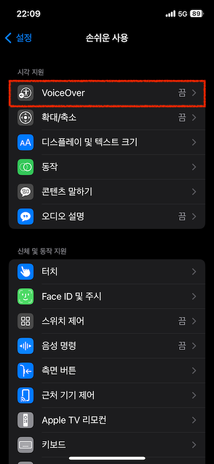
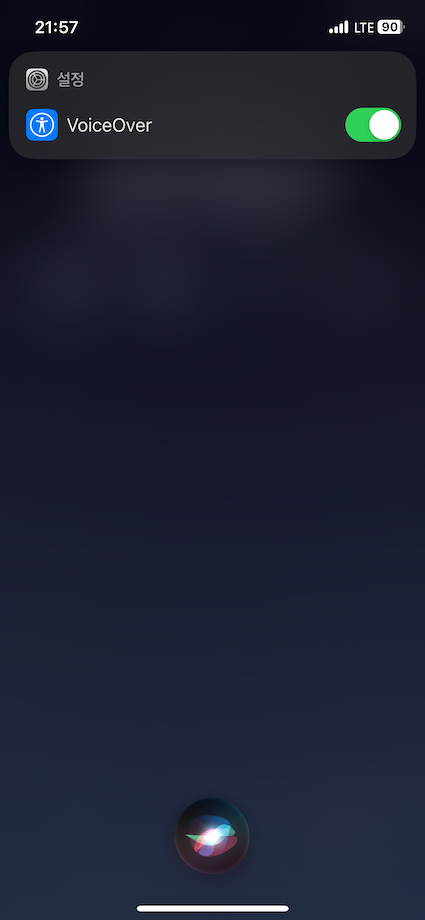

import { Meta } from "@storybook/blocks";

<Meta title="스크린 리더 사용법/모바일/VoiceOver" />

# VoiceOver for iOS

### VoiceOver 켜기

#### '설정' 앱에서 켜기

- '설정' 앱 실행 > '손쉬운 사용' 메뉴 선택 > 'VoiceOver' 메뉴 선택 > VoiceOver 켜기

<table>
  <tbody>
    <tr>
      <td>
        
      </td>
      <td>
        
      </td>
      <td>
        
      </td>
      <td>
        
      </td>
    </tr>
  </tbody>
</table>

#### 시리 (Siri)

- 시리를 사용하여 음성으로 VoiceOver를 켤 수 있습니다.
  - 예시) 🎙️ "VoiceOver 켜줘"



<br />

---

### VoiceOver 기본 제스처

#### 항목 탐색

- 화면 내 항목을 탐색할 수 있습니다. 이 때 VoiceOver는 현재 탐색중인 항목의 내용을 음성으로 안내합니다.

<table>
  <thead>
    <tr>
      <th>기능</th>
      <th>제스처</th>
    </tr>
  </thead>
  <tbody>
    <tr>
      <td>특정 항목 선택</td>
      <td>한 손가락으로 특정 항목 탭</td>
    </tr>
    <tr>
      <td>이전 항목 선택</td>
      <td>한 손가락으로 오른쪽에서 왼쪽으로 스와이프</td>
    </tr>
    <tr>
      <td>다음 항목 선택</td>
      <td>한 손가락으로 왼쪽에서 오른쪽으로 스와이프</td>
    </tr>
    <tr>
      <td>첫 번째 항목 선택</td>
      <td>네 손가락으로 중앙보다 상단 부분 탭</td>
    </tr>
    <tr>
      <td>마지막 항목 선택</td>
      <td>네 손가락으로 중앙보다 하단 부분 탭</td>
    </tr>
    <tr>
      <td>첫 번째 항목부터 전체 화면 자동 탐색</td>
      <td>두 손가락으로 아래에서 위로 스와이프</td>
    </tr>
    <tr>
      <td>현재 선택된 항목부터 전체 화면 자동 탐색</td>
      <td>두 손가락으로 위에서 아래로 스와이프</td>
    </tr>
  </tbody>
</table>

#### 항목 컨트롤

- 현재 선택된 항목에 대한 동작을 수행할 수 있습니다.

<table>
  <thead>
    <tr>
      <th>기능</th>
      <th>제스처</th>
    </tr>
  </thead>
  <tbody>
    <tr>
      <td>현재 선택중인 항목 실행</td>
      <td>한 손가락으로 이중 탭</td>
    </tr>
    <tr>
      <td>현재 선택중인 항목 추가 정보 안내받기</td>
      <td>세 손가락으로 탭</td>
    </tr>
  </tbody>
</table>

#### 스크롤

- 스크롤 가능한 화면 영역을 스크롤 할 수 있습니다.

<table>
  <thead>
    <tr>
      <th>기능</th>
      <th>제스처</th>
    </tr>
  </thead>
  <tbody>
    <tr>
      <td>위로 스크롤 </td>
      <td>세 손가락으로 위에서 아래로 스와이프</td>
    </tr>
    <tr>
      <td>아래로 스크롤 </td>
      <td>세 손가락으로 아래에서 위로 스와이프</td>
    </tr>
    <tr>
      <td>오른쪽으로 스크롤 </td>
      <td>세 손가락으로 오른쪽에서 왼쪽으로 스와이프</td>
    </tr>
    <tr>
      <td>왼쪽으로 스크롤 </td>
      <td>세 손가락으로 왼쪽에서 오른쪽으로 스와이프</td>
    </tr>
  </tbody>
</table>

#### VoiceOver 및 디바이스 제어

- VoiceOver 및 디바이스 동작을 제어할 수 있습니다.

<table>
  <thead>
    <tr>
      <th>기능</th>
      <th>제스처</th>
    </tr>
  </thead>
  <tbody>
    <tr>
      <td>VoiceOver 안내 음성 일시 정지 또는 다시 재생 </td>
      <td>두 손가락으로 탭</td>
    </tr>
    <tr>
      <td>VoiceOver 안내 음성 끄기 또는 다시 켜기 </td>
      <td>세 손가락으로 이중 탭</td>
    </tr>
    <tr>
      <td>VoiceOver 빠른 설정 열기 </td>
      <td>두 손가락으로 사중 탭</td>
    </tr>
    <tr>
      <td>화면 커튼 켜기 또는 끄기 </td>
      <td>세 손가락으로 삼중 탭</td>
    </tr>
    <tr>
      <td>이전 화면으로 돌아가기 </td>
      <td>두 손가락으로 문지르기(알파벳 'Z' 모양처럼 앞뒤로 세번)</td>
    </tr>
  </tbody>
</table>

```plaintext
💡 화면 커튼 기능은 VoiceOver를 사용할 때, 개인 정보 보호를 위해 디스플레이를 끌 수 있는 기능입니다.
화면 커튼이 켜져있는 상태는 디스플레이를 가려주고 있는 상태를 뜻합니다.
```

#### VoiceOver 로터

- VoiceOver 로터 기능을 사용할 수 있습니다. 로터를 통해 페이지를 탐색하고자 하는 방식을 선택할 수 있습니다.

<table>
  <thead>
    <tr>
      <th>기능</th>
      <th>제스처</th>
    </tr>
  </thead>
  <tbody>
    <tr>
      <td>로터 기능 선택</td>
      <td>
        두 손가락으로 시계 또는 반시계 방향으로 회전, 손가락을 떼면 해당 기능
        선택
      </td>
    </tr>
    <tr>
      <td>
        선택한 로터 기능에 따라 아래 두 가지 방식으로 동작
        <ul>
          <li>선택한 탐색 방식에 맞는 이전 항목 탐색</li>
          <li>선택한 로터 기능 단위 증가</li>
        </ul>
      </td>
      <td>한 손가락으로 아래에서 위로 스와이프</td>
    </tr>
    <tr>
      <td>
        선택한 로터 기능에 따라 아래 두 가지 방식으로 동작
        <ul>
          <li>선택한 탐색 방식에 맞는 다음 항목 탐색</li>
          <li>선택한 로터 기능 단위 감소</li>
        </ul>
      </td>
      <td>한 손가락으로 위에서 아래로 스와이프</td>
    </tr>
  </tbody>
</table>

##### 로터 옵션 항목

- 로터 항목은 기본적으로 VoiceOver 초점이 맞춰진 항목을 기반으로 선택할 수 있는 기능이 변경됩니다.
- '로터 항목'에서 자주 사용하는 로터 기능을 미리 선택해두면 로터 기능 선택 제스처를 통해 선택해둔 기능들을 사용할 수 있습니다.

```plaintext
💡 '로터 항목' 위치: '설정' > '손쉬운 사용' > 'VoiceOver' > '로터' > '로터 항목'
```

##### 로터 기능을 통해 제어할 수 있는 옵션 항목들은 다음과 같습니다.

###### 텍스트 읽기

- 텍스트를 읽어줄 때 한번에 어떤 단위 만큼 읽어줄지 선택합니다.
  - 문자
  - 단어
  - 줄

###### 요소 단위로 탐색하기

- 선택된 요소만 탐색하고자 할때 선택합니다.
  - 컨테이너
  - 머리말
  - 랜드마크
  - 링크
  - 방문한 링크
  - 방문하지 않은 링크
  - 버튼
  - 표
  - 목록
  - 형식 제어
  - 텍스트필드
  - 검색필드
  - 이미지
  - 동일한 항목

###### 입력 방식 변경하기

- 입력이 필요한 경우 입력 모드를 변경합니다.
  - 표준 입력: 왼쪽 또는 오른쪽으로 스와이프하여 키보드 키를 선택하고, 이중 탭 하여 선택된 문자를 입력합니다.
  - 터치 입력: 키보드 키를 터치한 후 손가락을 끌면서 원하는 키를 선택하고, 손가락을 뗀 위치에 있는 문자가 입력됩니다.
  - 다이렉트 터치 입력: VoiceOver를 끈 상태와 동일하게 입력합니다.

###### VoiceOver 제어하기

- VoiceOver의 작동 방식을 변경합니다.
  - 음량
  - 말하기 속도

```plaintext
💡 로터와 관련된 더 자세한 내용은 아래 Apple 공식 지원 사이트를 참고할 수 있습니다.
'iPhone, iPad 및 iPod touch의 VoiceOver 로터에 관하여': https://support.apple.com/ko-kr/HT204783
```
