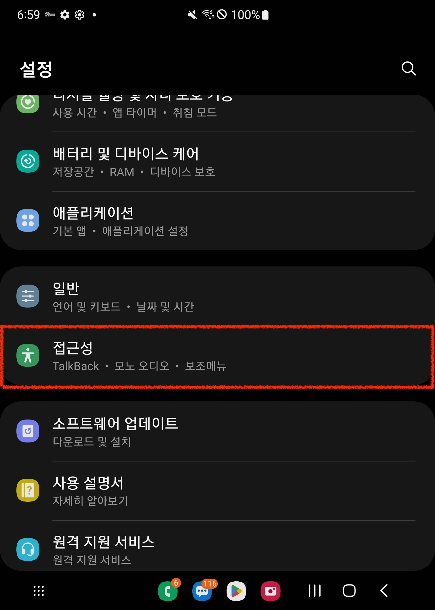
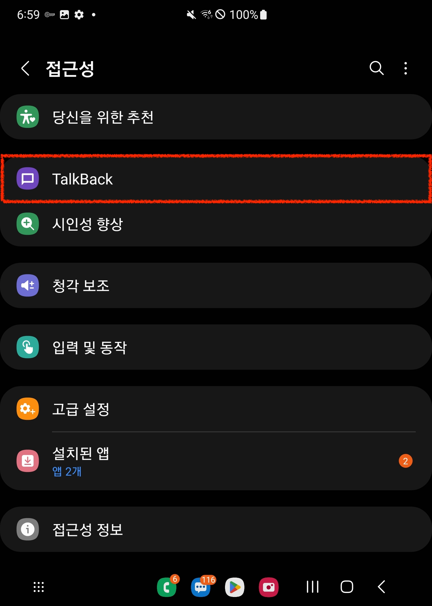
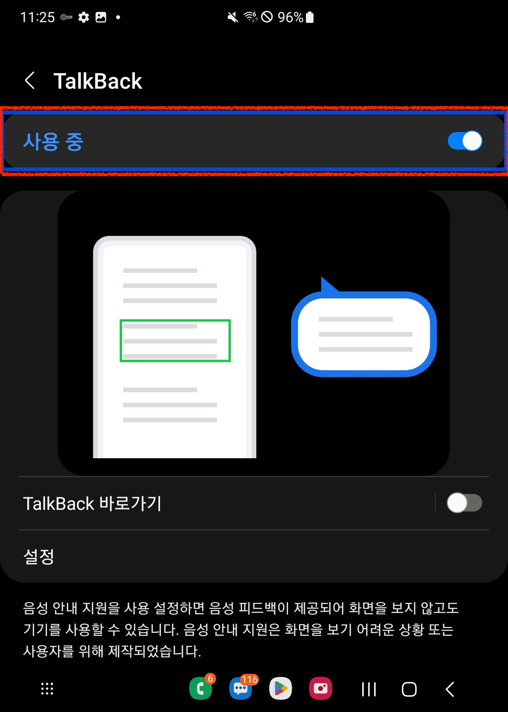
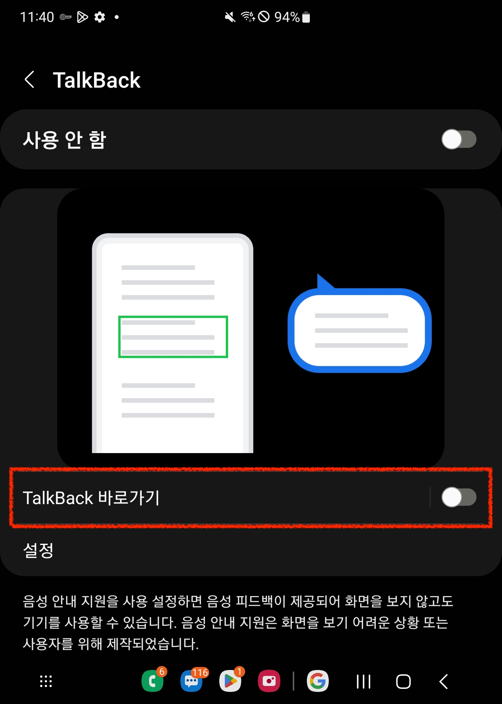
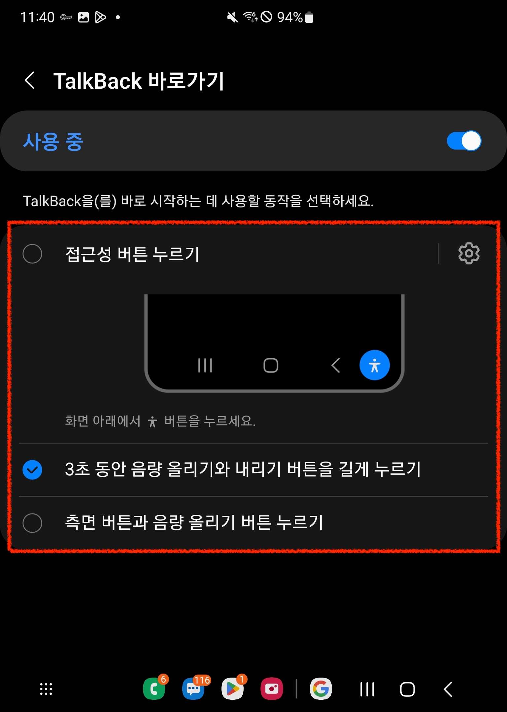

import { Meta } from "@storybook/blocks";

<Meta title="스크린 리더 사용법/모바일/TalkBack" />

# TalkBack for Android

### TalkBack 켜기

#### '설정' 앱에서 켜기

- '설정' 앱 실행 > '접근성' 메뉴 선택 > 'TalkBack' 메뉴 선택 > TalkBack 켜기

<table>
  <tbody>
    <tr>
      <td>
        
      </td>
      <td>
        
      </td>
      <td>
        
      </td>
      <td>
        
      </td>
    </tr>
  </tbody>
</table>

#### TalkBack 바로가기 설정

- '설정' 앱 실행 > '접근성' 메뉴 선택 > 'TalkBack' 메뉴 선택 > TalkBack 바로가기 기능 켜기
- 3가지 방식 중 1개 이상의 방식을 체크하면 해당 방식으로 TalkBack을 켜고 끌 수 있습니다.

<table>
  <tbody>
    <tr>
      <td>
        
      </td>
      <td>
        
      </td>
      <td>
        
      </td>
    </tr>
  </tbody>
</table>

#### Google 어시스턴트 또는 빅스비

- Google 어시스턴트를 또는 빅스비를 사용하여 음성으로 TalkBack을 켤 수 있습니다.
  - 예시) 🎙️ "TalkBack 켜줘"

<br />

---

### TalkBack 제스처

#### 항목 탐색

- 화면 내 항목을 탐색할 수 있습니다. 이 때 TalkBack은 현재 탐색중인 항목의 내용을 음성으로 안내합니다.

<table>
  <thead>
    <tr>
      <th>기능</th>
      <th>제스처</th>
    </tr>
  </thead>
  <tbody>
    <tr>
      <td>특정 항목 선택</td>
      <td>한 손가락으로 특정 항목 탭</td>
    </tr>
    <tr>
      <td>이전 항목 선택</td>
      <td>한 손가락으로 오른쪽에서 왼쪽으로 스와이프</td>
    </tr>
    <tr>
      <td>다음 항목 선택</td>
      <td>한 손가락으로 왼쪽에서 오른쪽으로 스와이프</td>
    </tr>
    <tr>
      <td>다음 항목부터 전체 화면 자동 탐색</td>
      <td>두 손가락으로 삼중 탭</td>
    </tr>
  </tbody>
</table>

#### 항목 컨트롤

- 현재 선택된 항목에 대한 동작을 수행할 수 있습니다.

<table>
  <thead>
    <tr>
      <th>기능</th>
      <th>제스처</th>
    </tr>
  </thead>
  <tbody>
    <tr>
      <td>현재 선택중인 항목 실행</td>
      <td>한 손가락으로 이중 탭</td>
    </tr>
    <tr>
      <td>선택한 텍스트 복사</td>
      <td>세 손가락으로 이중 탭</td>
    </tr>
    <tr>
      <td>붙여넣기</td>
      <td>세 손가락으로 삼중 탭</td>
    </tr>
  </tbody>
</table>

#### 스크롤

- 스크롤 가능한 화면 영역을 스크롤 할 수 있습니다.

<table>
  <thead>
    <tr>
      <th>기능</th>
      <th>제스처</th>
    </tr>
  </thead>
  <tbody>
    <tr>
      <td>위로 스크롤</td>
      <td>두 손가락으로 위에서 아래로 스와이프</td>
    </tr>
    <tr>
      <td>아래로 스크롤</td>
      <td>두 손가락으로 아래에서 위로 스와이프</td>
    </tr>
    <tr>
      <td>오른쪽으로 스크롤</td>
      <td>두 손가락으로 오른쪽에서 왼쪽으로 스와이프</td>
    </tr>
    <tr>
      <td>왼쪽으로 스크롤</td>
      <td>두 손가락으로 왼쪽에서 오른쪽으로 스와이프</td>
    </tr>
  </tbody>
</table>

#### TalkBack 및 디바이스 제어

- TalkBack 및 디바이스 동작을 제어할 수 있습니다.

<table>
  <thead>
    <tr>
      <th>기능</th>
      <th>제스처</th>
    </tr>
  </thead>
  <tbody>
    <tr>
      <td>TalkBack 안내 음성 일시 정지 또는 다시 재생</td>
      <td>두 손가락으로 탭</td>
    </tr>
    <tr>
      <td>홈으로 가기</td>
      <td>
        한 손가락으로 손가락을 떼지 않고 위로 스와이프 후 왼쪽으로 스와이프
      </td>
    </tr>
    <tr>
      <td>뒤로 가기</td>
      <td>
        한 손가락으로 손가락을 떼지 않고 아래로 스와이프 후 왼쪽으로 스와이프
      </td>
    </tr>
    <tr>
      <td>최근 사용 앱</td>
      <td>
        한 손가락으로 손가락을 떼지 않고 왼쪽으로 스와이프 후 위로 스와이프
      </td>
    </tr>
    <tr>
      <td>TalkBack 빠른 설정 열기</td>
      <td>
        한 손가락으로 손가락을 떼지 않고 아래로 스와이프 후 오른쪽으로 스와이프
      </td>
    </tr>
    <tr>
      <td>앱 목록 열기</td>
      <td>(홈 화면에서) 두 손가락으로 아래에서 위로 스와이프</td>
    </tr>
  </tbody>
</table>

#### 읽기 제어 설정

- 페이지를 탐색하고자 하는 방식을 선택할 수 있습니다.

<table>
  <thead>
    <tr>
      <th>기능</th>
      <th>제스처</th>
    </tr>
  </thead>
  <tbody>
    <tr>
      <td>읽기 제어 설정</td>
      <td>
        <p>1. 다음 기능</p>
        <ul>
          <li>세 손가락으로 아래로 스와이프</li>
          <li>한 손가락을 떼지않고 위로 스와이프 후 아래로 스와이프</li>
        </ul>
        <br />
        <p>2. 이전 기능</p>
        <ul>
          <li>세 손가락으로 위로 스와이프</li>
          <li>손가락을 떼지않고 아래로 스와이프 후 위로 스와이프</li>
        </ul>
      </td>
    </tr>
    <tr>
      <td>
        선택한 기능에 따라 아래 두 가지 방식으로 동작
        <ul>
          <li>선택한 탐색 방식에 맞는 이전 항목 탐색</li>
          <li>선택한 기능 단위 증가</li>
        </ul>
      </td>
      <td>한 손가락으로 아래에서 위로 스와이프</td>
    </tr>
    <tr>
      <td>
        선택한 기능에 따라 아래 두 가지 방식으로 동작
        <ul>
          <li>선택한 탐색 방식에 맞는 다음 항목 탐색</li>
          <li>선택한 기능 단위 감소</li>
        </ul>
      </td>
      <td>한 손가락으로 위에서 아래로 스와이프</td>
    </tr>
  </tbody>
</table>

##### 읽기 제어 설정 항목

- 읽기 제어 설정 항목은 기본적으로 TalkBack 초점이 맞춰진 항목을 기반으로 선택할 수 있는 기능이 변경됩니다.
- '읽기 제어 기능 맞춤설정'에서 자주 사용하는 기능을 미리 선택해두면 읽기 제어 설정 제스처를 통해 선택해둔 기능들을 사용할 수 있습니다.

```plaintext
💡 '읽기 제어 기능 맞춤설정' 위치: '설정' > '접근성' > 'TalkBack' > '설정' > '메뉴 맞춤설정' > '읽기 제어 기능 맞춤설정'
```

##### 읽기 제어 설정을 통해 제어할 수 있는 옵션 항목들은 다음과 같습니다.

###### 텍스트 읽기

- 텍스트를 읽어줄 때 한번에 어떤 단위 만큼 읽어줄지 선택합니다.
  - 문자
  - 단어
  - 줄
  - 단락

###### 요소 단위로 탐색하기

- 선택된 요소만 탐색하고자 할때 선택합니다.
  - 제목
  - 컨트롤
  - 링크
  - 랜드마크
  - 창

###### TalkBack 제어하기

- TalkBack의 작동 방식을 변경합니다.
  - 음량
  - 말하기 속도

```plaintext
💡 읽기 제어 설정과 관련된 더 자세한 내용은 아래 Andrioid 공식 지원 사이트를 참고할 수 있습니다.
'TalkBack 메뉴 및 읽기 제어 설정 사용하기': https://support.google.com/accessibility/android/answer/6007066?sjid=10385106587067655876-AP
```
